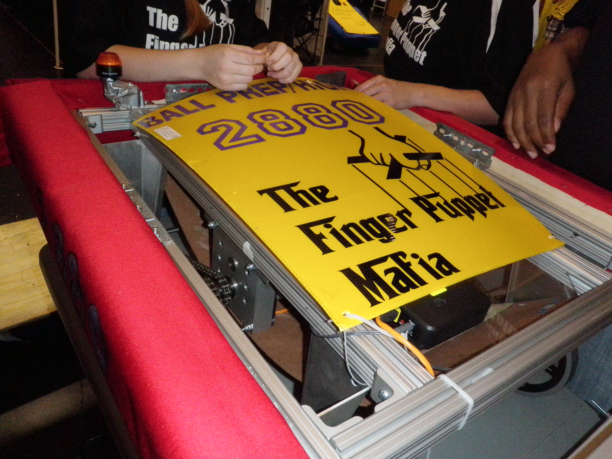

Earlier this year an external drive of mine died, and I was afraid I lost all of the data on it. After copying a bunch of files overnight to it, I woke up to the drive being read only with an unreadable superblock. Even though I eventually saved the data by buying a new external hard drive (Thanks Microcenter!) [^1], I was very scared for a while.

I've lost large chunks of my digital existence before; when I lost access to my College email without downloading everything, I lost years of personal and professional correspondence. I've lost the original version of my first website, shitty HTML and everything, because the files were on my college's computing environment[^2], and they just got overwritten when I pushed out new updates to my site (this was before I used `git`). I feel weirdly attached to 'historical' data of mine, and find it very interesting to revisit them now and then.

Anyway, this yapping is just context for the fact I thought it'd be fun to do some scathing code reviews of the first code I ever wrote, publically, because why not. But first, I have to do some personal archeology to figure out what's the first code I wrote that's worth
reviewing.

## FIRST Robotics Competition: LabView vs Java

So, technically, the first code I ever wrote was in [LabView](https://en.wikipedia.org/wiki/LabVIEW). I got into the
FIRST Robotics Competetion team in my high school when I was a freshman, and even though we made
the jankiest robot, it was pretty fun.



And after we lost pretty much all of our
instutional knowledge the next year when the seniors graduated, there was no one to program the robot.
Someone had to do it; FRC at the time supported Java and LabView, so I tried a bit of each.

The earliest code that I wrote (not a tutorial file) is a `Easy.vi` file, last modified on November 16th, 2010, from when I was trying to
learn LabView. From that we can see that I wrote... [^3]

<image alt="3 widgets, a boolean, two sliders, and a gauage that sums the sliders." src="../../assets/old-code-review/image copy.png">

the equivalent of:

```java
boolean bool = true;
int slider1 = 4, slider2 = 6;
int guage = slider1 + slider2;
```

lol. lmao, even.

My earliest Java code I can find is a Hello World (obviously) about a month later on December 5th, 2010. It's nothing more than what it sounds like.

A few days later on December 8th, 2010, I wrote `FourLines.java`: The code, looks like this:
```
{\rtf1\ansi\ansicpg1252\cocoartf949\cocoasubrtf540
{\fonttbl\f0\fswiss\fcharset0 Helvetica;}
{\colortbl;\red255\green255\blue255;}
\margl1440\margr1440\vieww9000\viewh8400\viewkind0
\pard\tx720\tx1440\tx2160\tx2880\tx3600\tx4320\tx5040\tx5760\tx6480\tx7200\tx7920\tx8640\ql\qnatural\pardirnatural

\f0\fs24 \cf0  public class Fourlines\
\{\
 public static void main(String args[])\
  \{\
System.out.println("Line 1");\
System.out.println("Line 2");\
System.out.println("Line 3");\
System.out.println("Line 4");\
       \}\
\}}
```

Some observations:

* I must have been coding in Notepad and saved it as RTF. Not ever sure if I figured out how to compile it. -2 points.
* It prints "Line 1/2/3/4" with individual calls. Not sure why 4, but it is more functionality than Hello World. + 1

From that experience, Java and other text-based languages scared me, so I struggled around with LabView until we could get a joystick to control our robot's wheels, which was all we needed.

Unfortunately, I don't have that code. We had a little [Intel Classmate laptop](https://en.wikipedia.org/wiki/Classmate_PC)
that had all of our code, and I never thought to copy any of it over.

<image alt="The Intel classmate laptop with the joysticks and e-stop button" src="../../assets/old-code-review/computer-pic.jpg">

Godspeed to that lil laptop. The code was likely copy pasted from another team helping us, so
it wouldn't have been a substantive review anyway.

<image alt="a laptop sitting on a different robot (from 2011)" src="../../assets/old-code-review/image.png">

## Java Projects

After using LabView the small bit I had, I was very confused. While I could easily place input sliders and outputs and connect them with wires,
I struggled to understand what I was doing. I remember trying to understand more about the inputs to some
visual blocks and being baffled at what a String was. Due to various funding issues with our robotics team[^4],
we weren't going to compete in a competition that year. With the extra time, it was time to try to learn the basics
of programming again.

A mentor (shout out Mr. Burke) gave me a Java (specifically the AP computer science) book, and with that and [NetBeans](https://en.wikipedia.org/wiki/NetBeans), I set about actually trying to teach myself Java.

### Rubiks Cube

My first big coding project that I took on by myself was trying to make a rubik's cube solver.
I could do one by hand, and thought that I would be very cool if I could make a computer do it
for me.

The code output (as I left it) does this:

```
Creating new 3 by 3 Rubik's cube!
Displaying top side 

1 1 1 
1 1 1 
1 1 1 
Displaying front side 

2 2 2 
2 2 2 
2 2 2 
Displaying bottom side 

6 6 6 
6 6 6 
6 6 6 
Displaying Entire Cube 


      1 1 1
      1 1 1
      1 1 1
3 3 3 2 2 2 5 5 5
3 3 3 2 2 2 5 5 5
3 3 3 2 2 2 5 5 5
      6 6 6
      6 6 6
      6 6 6
      4 4 4 
      4 4 4 
      4 4 4 

Top Face Clockwise
Displaying Entire Cube 


      1 1 1
      1 1 1
      1 1 1
2 2 2 5 5 5 4 4 4
3 3 3 2 2 2 5 5 5
3 3 3 2 2 2 5 5 5
      6 6 6
      6 6 6
      6 6 6
      4 4 4 
      4 4 4 
      3 3 3 

...
```

with a more various turns. I believe I had written this to check that I actually had the turning correct,
and had planned on writing the algorithm next, had I actually known what I was doing.

The full code you can see at ... (TODO(bryce): add link) (which I've kindly formatted from the mess that I left it in),
but let's look at some snippets.


## First personal big project

I think my first big project, that's actually in a semi complete state and I did from scratch was my Science fair project that year; Fractal Finder.


## Other fun finds

[^1]: Not the point of this post, but I ended up using [`ddrescue`](https://www.gnu.org/software/ddrescue/manual/ddrescue_manual.html) to copy the data off of the failed drive onto a new on I bought. Highly recommend. This post took me so long to write that I lost my exact notes on what I did, but [these](https://superuser.com/questions/1024643/in-which-case-should-i-prefer-dd-over-gnu-ddrescue) [several](https://unix.stackexchange.com/questions/781037/mount-cant-read-superblock) [pages](https://www.linuxbabe.com/desktop-linux/fix-cant-read-superblock-error+) had the best info on how to fix it.

[^2]: Shout out [CLEAR](https://www.clear.rice.edu/).

[^3]: LabView is proprietary, and you can't really view the code without paying. However, National Instruments
made it so the free community edition can view `*.vi` files, which is nice I guess. https://forums.ni.com/t5/LabVIEW/Solutions-for-Viewing-VIs/m-p/4260523#M1240569.

[^4]: FRC makes teams pay ~$3k or $4k to participate in the competitions, in addition to funds required to
buy building materials, travel to the competition, hotels, etc. We were heavily dependent on
grants to actually participate, and the org that had given us our grants for the previous 3 years had stopped
providing grants. :/ bit of a shame. 