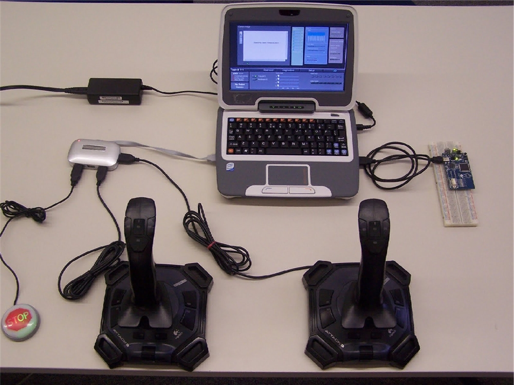
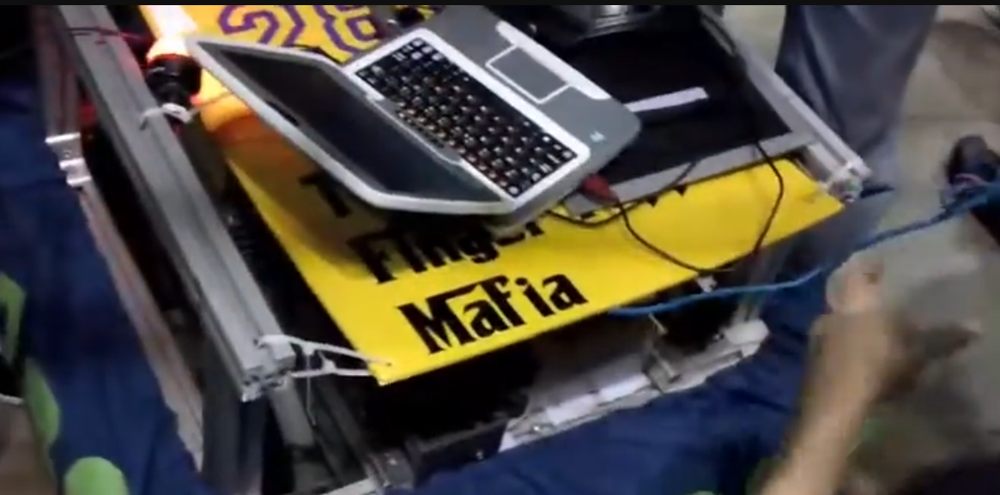
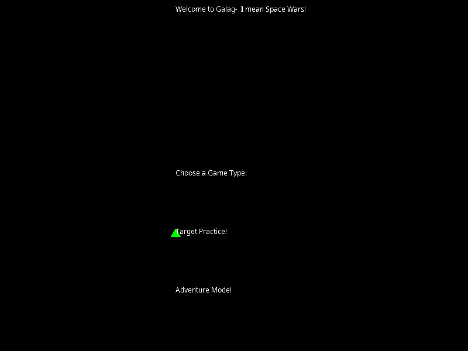
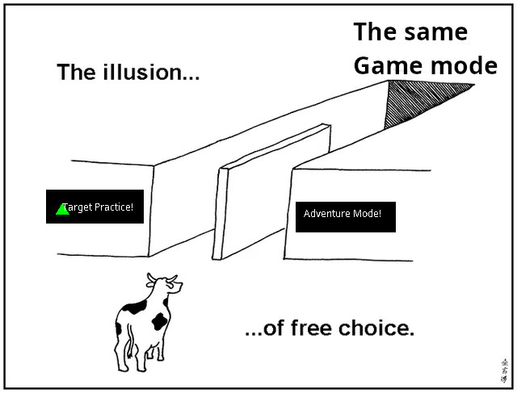
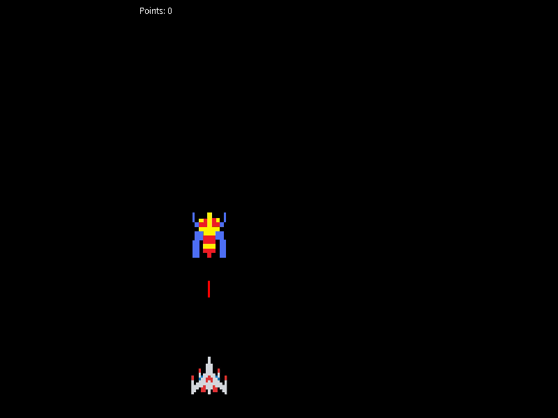

Earlier this year an external drive of mine died, and I was afraid I lost all of the data on it. After copying a bunch of files overnight to it, I woke up to the drive being read only with an unreadable superblock. Even though I eventually saved the data by buying a new external hard drive (Thanks Microcenter!) [^1], I was very scared for a while.

I've lost large chunks of my digital existence before; when I lost access to my College email without downloading everything, I lost years of personal and professional correspondence. I've lost the original version of my first website, shitty HTML and everything, because the files were on my college's computing environment[^2], and they just got overwritten when I pushed out new updates to my site (this was before I used `git`). I feel weirdly attached to 'historical' data of mine, and find it very interesting to revisit them now and then.

This is all context for some reminiscing I wanted to do, to bring you, dear reader, along with me. Goals that I have for this "write as I discover" post :

* do some personal archeology to figure out what I even wrote and when, finding records of events that shaped my whole career without me even realizing it.
* inspect how I wrote software; not like a code critique, but who my audience was, how I approached writing code, etc.
* compare it to how I write software now, and what any of this means.


## FIRST Robotics Competition: LabView vs Java

So, technically, the first code I ever wrote was in [LabView](https://en.wikipedia.org/wiki/LabVIEW). I got into the
FIRST Robotics Competetion team in my high school when I was a freshman, and even though we made
the jankiest robot, it was pretty fun.


And after we lost pretty much all of our
instutional knowledge the next year when the seniors graduated, there was no one to program the robot.
Someone had to do it; FRC at the time supported Java and LabView, so I tried a bit of each.

The earliest code that I wrote (not a tutorial file) is a `Easy.vi` file, last modified on November 16th, 2010, from when I was trying to
learn LabView. From that we can see that I wrote... [^3]


a boolean that does nothing and two sliders connected to a guage. The equivalent of:

```java
boolean bool = true;
int slider1 = 4, slider2 = 6;
int guage = slider1 + slider2;
```

which is funny. Like why did I even do this.

My earliest Java code I can find is a 'Hello World' about a month later on December 5th, 2010.

A few days later on December 8th, 2010, I wrote `FourLines.java`: The code, looks like this:
```
{\rtf1\ansi\ansicpg1252\cocoartf949\cocoasubrtf540
{\fonttbl\f0\fswiss\fcharset0 Helvetica;}
{\colortbl;\red255\green255\blue255;}
\margl1440\margr1440\vieww9000\viewh8400\viewkind0
\pard\tx720\tx1440\tx2160\tx2880\tx3600\tx4320\tx5040\tx5760\tx6480\tx7200\tx7920\tx8640\ql\qnatural\pardirnatural

\f0\fs24 \cf0  public class Fourlines\
\{\
 public static void main(String args[])\
  \{\
System.out.println("Line 1");\
System.out.println("Line 2");\
System.out.println("Line 3");\
System.out.println("Line 4");\
       \}\
\}}
```

Some observations:

* I must have been coding in Notepad and saved it as RTF. Not ever sure if I figured out how to compile it. -2 points.
* It prints "Line 1/2/3/4" with individual calls. Not sure why 4, but it is more functionality than Hello World. +1 point.

From that experience, Java and other text-based languages scared me, so I struggled around with LabView until we could get a joystick to control our robot's wheels, which was all we needed.

Unfortunately, I don't have that code. We had a little [Intel Classmate laptop](https://en.wikipedia.org/wiki/Classmate_PC)
that had all of our code, and I never thought to copy any of it over.



Godspeed to that lil laptop. The code was likely copy pasted from another team helping us, so
it wouldn't have been a substantive review anyway.



## Java Projects

After using LabView the small bit I had, I was very confused. While I could easily place input sliders and outputs and connect them with wires,
I struggled to understand what I was doing. I remember trying to understand more about the inputs to some
visual blocks and being baffled at what a String was. Due to various funding issues with our robotics team[^4],
we weren't going to compete in a competition that year. With the extra time, it was time to try to learn the basics
of programming again.

A mentor (shout out Mr. Burke) gave me a Java (specifically the AP computer science) book, and with that and [NetBeans](https://en.wikipedia.org/wiki/NetBeans), I set about actually trying to teach myself Java.

### Rubiks Cube

After spending most of Fall 2011 doing various tutorials and reading through the book, my first big coding project that I took on by myself in Feburary 2012 was trying to make a Rubik's cube solver.
I could do one by hand, and thought that I would be very cool if I could make a computer do it
for me.

The code output (as I left it) does this:

```
Creating new 3 by 3 Rubik's cube!
Displaying top side 

1 1 1 
1 1 1 
1 1 1 
Displaying front side 

2 2 2 
2 2 2 
2 2 2 
Displaying bottom side 

6 6 6 
6 6 6 
6 6 6 
Displaying Entire Cube 


      1 1 1
      1 1 1
      1 1 1
3 3 3 2 2 2 5 5 5
3 3 3 2 2 2 5 5 5
3 3 3 2 2 2 5 5 5
      6 6 6
      6 6 6
      6 6 6
      4 4 4 
      4 4 4 
      4 4 4 

Top Face Clockwise
Displaying Entire Cube 


      1 1 1
      1 1 1
      1 1 1
2 2 2 5 5 5 4 4 4
3 3 3 2 2 2 5 5 5
3 3 3 2 2 2 5 5 5
      6 6 6
      6 6 6
      6 6 6
      4 4 4 
      4 4 4 
      3 3 3 

...
```

with a more various rotations. I believe I had written this to check that I actually had the turning correct,
and had planned on writing the algorithm next, had I actually known what I was doing.

You can see the original state of the code [in the first commit of the repo](https://github.com/BryceStevenWilley/my_old_code/blob/7d3c12498bf6979324f936a0a5a31030d4c5bad2/Rubiks/src/rubik/s/RubikS.java), or a slightly formatted version at  The full code you can see at ... (TODO(bryce): add link) (which I've kindly formatted from the mess that I left it in),
but let's look at some snippets. To get the full effect, you can listen to [Maths by deadmau5](https://www.youtube.com/watch?v=wk-iScJwuCA) on repeat, as I did while writing this code.

First the code structure: everything was a single file, `src/rubik/s/RubikS.java`. Honestly, a great move, because trying to understand how different files are connected when you're starting out programming is fairly confusing.
However I did even better and put multiple classes in the same file. Not even inner classes or anything. I've been writing Java professionally for 5 years now and didn't
even realize you could do that. [^5]

The classes defined were (in this order):

```java
public class RubikS
{
    public static void main(String[] args) {
        ...
        ThreeByThreeReal first = new ThreeByThreeReal();
        ...
    }
}

abstract class RubikImagine {
    abstract public void leftClockwise();

    abstract public void leftCounterClockwise();

    abstract public void rightClockwise();

    ...

    abstract public void dispCube();
}

class SpaceSavers extends ThreeByThreeReal{
    /*  This class is to save space for lengthy, repetitive code that can be entered once.    
     * 
     */
    ...
}

class ThreeByThreeReal extends RubikImagine { ... }
```

Compliment sandwich here:

* Forward thinking making abstracting the idea of the cube away from the actual implementation. No idea why I did that, but I can see it being useful.
* The class hierachy makes, ... pretty much no sense. The main being somewhere else
entirely is weird, but I don't have a problem with. The abstract class and concrete classes, sure. But `SpaceSavers` doesn't need to implement `ThreeByThreeReal`, and
itself isn't even used in the main.
* `SpaceSavers` is a useful class! It doesn't need to extend the concrete implementation, but still useful. Also one of the better comments in the program, lol.

As for a detailed look, the implementation of `leftClockwise()` is indicitive of the code quality here.

```java
class ThreeByThreeReal extends RubikImagine {

    protected int[][] top;
    protected int[][] front;
    protected int[][] left;
    protected int[][] back;
    protected int[][] right;
    protected int[][] bottom;

    /*
     * On the following turn methods, the sides are dealt with as such:
     * - the front, left, back, and right faces are viewed straight on
     * with the bottom facing down and the top up.
     * - The top is viewed the front face down.
     * - The bottom is viewed with the front face facing up, and the back
     * face facing down. All other faces (left and right) are facing
     * the same direction
     * 
     */
    public void leftClockwise() { // Turns the left face (set as green default) clockwise.
        System.out.println("Left Face Clockwise");
        int temp1 = top[0][0];
        int temp2 = top[1][0];
        int temp3 = top[2][0];
        int temp4 = left[0][0];
        int temp5 = left[0][1];
        for (int i = 0; i < 3; i++) {
            top[i][0] = back[2 - i][0];
            back[2 - i][0] = bottom[i][0];
            bottom[i][0] = front[i][0];
        }
        front[0][0] = temp1;
        front[1][0] = temp2;
        front[2][0] = temp3;

        left[0][0] = left[2][0];
        left[2][0] = left[2][2];
        left[2][2] = left[0][2];
        left[0][2] = temp4;

        left[0][1] = left[1][0];
        left[1][0] = left[2][1];
        left[2][1] = left[1][2];
        left[1][2] = temp5;

    }
}
```

Honestly impressed with myself here. The code is definitely repetitive (almost
every function is this same structure), but even today, I probably couldn't
tell you a good data structure to hold a Rubik's cube. It's could use some
better abstraction / reuse, but any code like this is going to be tricky, and the fact
I used some for loops is a good sign. Even though I stopped at implementing the
cube engine, with some clunky method calls, it still does something. If I
were to take a shot at this again, I'd make sure to make the turn calls parameterized, which would make it easier to call them.

Take away: write the most repetitive shit you want, as long as it gets the job done.


### Fractal Analysis

My first project that I wrote that I actually seriously used my science fair project, where I wrote code that analyzed the 'fractal' nature in classical music.[^6]

The programming bit of the project was that it read in notes from a text file, put the
values in some objects, and did some calculations based on the intervals of the notes. I did the rest of the analysis
and graphing of those values in excel (I was not about to try to figure out [Java Swing](https://en.wikipedia.org/wiki/Swing_(Java)) for this one, lol).

While there's a bit to be said if I was even measuring fractalness, the code itself
is pretty fully featured; it can output different displays of the data ('visual' or 'spreadsheet', though they're really just both text output), and I left myself some
good comments.

```java
/*
 * The proper formatting for the input files are as follows:
 *    the name of the file should be: 
 *       <name of song>raw<L for left hand, R for right hand>.dat
 *       ex:  inventionInCrawR.dat
 *    the file: 1st line= the number of notes in the piece(n)
 *              2nd line- n + 1 lines= the notes of the piece in the format:
 *                   <note letter><accidental><octave>
 *                n + 2- end (2n +1)= the origin of each note as a double 
 *                    value, with 0 as the first beat of the song
 * 
 * the output of the file is controlled by which function is currently
 * hardwired in, but the name of the output function should be either 
 * <name of song>ss<L or R><reduction number>.dat for Spreadsheet or 
 * <name of Song>vi<L or R><reduction number>.dat for Visual
 *                   
 */
```

I could probably recreate the data with new songs, but I do remember the hardest part being the fact that I manually wrote each note in a spreadsheet first and had
to calculate all of the note timings from the beginning of the song, which was very tedious.


### Galaga Clone

The last project I wanted to look at was the first game I wrote; the barest of bones
of a galaga clone. This was the first project that I used an external library
for, the [GoodSky Game Engine](https://github.com/goodsky/game-nuggets/tree/master/goodsky-game-library). I'm not sure how exactly I came across that engine, but the author of the engine did make a series of Java Programming Tutorials on YouTube in 2011, and was a was also mentoring for FIRST Robotics teams at the time. So there's a good chance I was recommended the tutorials and the library by someone in FRC. Either way, it's a great little library to learn from. It wrapped over the Java APIs for sound and GUIs so I didn't have to work with them (i.e. Swing! I did eventually use it!).

My galaga was much more quaint though; there was an opening menu, with two options that lead to the same game mode.





The game was entirely pngs of the galaga spaceship sprite that you could move back and forth and shoot missles, and the enemy alien sprite that you shot at as they slowly move down. There's a little point counter in the top left that adds 10 points with each enemy hit. Not much else happens, it's just an infinite shooter. If you miss one, no more appear though.



## Takeaways

I came at this with some questions I wanted to answer:

* I wanted to make a recond of all of this, just to have it! Feels kinda fun to put together / revitalize old code without an external
pressure.
* Who did I write for? Definitely just myself; all of those programs were only for myself. Even the science fair code; the analysis was for the judges, but the code itself was just for me. In hindsight, this makes a lot of sense, because the code is messy, the formatting is whack, and there are bugs all over the place, but none of that matters because I was the only one using the code, only for a short amount of time.[^7]
* How do I write software now? I have a very strong focus on
  maintainable code when I write now; I have to revisit so much stuff that I've written even only 6 or so months prior, that it can be hard for me to remember every thing about it, and when I am looking back at it, it's almost always to fix a bug or expand it in some way. Additionally, I have co-workers who have to read what I wrote, and other developers and end users who use what I wrote.


I've been reviewing a lot of AI generated code lately, and while it can sometimes be competent, most of the time it isn't. I've seen:

* comments every other line that simply restate what the code does, without any sort of why (this is so common, it's usually how I clock AI written code now)
* extremely detailed and error prone methods for very small features (e.g. math heavy code just to calculate if a text color has high enough contrast with it's background for some pre-generated background colors).
* writing different functions that do the same thing, in just slightly different ways

I bring up AI written code because there are some surface similarities between it and the type of code I wrote 15 years ago.
Vibe coding is similar to what I wrote, in that there's a sort of focus on the results, what the program does, and nothing else about the code. I have a lot of conflicted feelings about AI generated code
(mostly negative, slightly less negative than stuff like Gen AI art or music though, unequivicoally hate that shit), but at the same time, if I was mentoring a student or junior coder who wrote code like that, I wouldn't feel the same way about it, and depending on the context, wouldn't care at all, and encourage them to keep writing like code like that.

I think the main difference is that (energy usage aside [^8]), vibe coding for yourself is fine. If you want to make an application that you will use and have fun with, go wild.
But by writing code for other people, either your co-workers or your users, you have a moral obligation to understand what you are giving them, and if they have questions about it or want you to fix bugs, you should be prepared to do so. Gen AI code has all of the same social problems that other code has (transfering theories of knowledge about the code from person to person), but we've already skipped the first step with the code's original author.

ALl this to say I'm not planning to go back to writing like I did when I first started coding any time soon, but maybe in my personal projects, I'll lean more towards results than I have before.


## Other fun finds

[^1]: Not the point of this post, but I ended up using [`ddrescue`](https://www.gnu.org/software/ddrescue/manual/ddrescue_manual.html) to copy the data off of the failed drive onto a new on I bought. Highly recommend. This post took me so long to write that I lost my exact notes on what I did, but [these](https://superuser.com/questions/1024643/in-which-case-should-i-prefer-dd-over-gnu-ddrescue) [several](https://unix.stackexchange.com/questions/781037/mount-cant-read-superblock) [pages](https://www.linuxbabe.com/desktop-linux/fix-cant-read-superblock-error+) had the best info on how to fix it.

[^2]: Shout out [CLEAR](https://www.clear.rice.edu/).

[^3]: LabView is proprietary, and you can't really write code without paying for the full version. However, National Instruments made it so the free community edition [can view](https://forums.ni.com/t5/LabVIEW/Solutions-for-Viewing-VIs/m-p/4260523#M1240569) `*.vi` files, which is nice I guess.

[^4]: FRC makes teams pay ~$3k or $4k to participate in the competitions, in addition to funds required to (TODO(bryce): do I have any specifics for the grant info?) buy building materials, travel to the competition, hotels, etc. We were heavily dependent on grants to actually participate, and the org that had given us our grants for the previous 3 years had stopped providing grants. :/ bit of a shame. 

[^5]: Apparently this [breaks very quickly](https://stackoverflow.com/a/2336762) if you do start using multiple files, but eh.

[^6]: It's really just the methods of [this paper](https://pmc.ncbi.nlm.nih.gov/articles/PMC51477/pdf/pnas01058-0549.pdf) applied to some other piano pieces I could play and a Foo Fighter's song that I liked and had the sheet music to.

[^7]; I did want to extend my sciente fair project the next year to attempt to generate music, but wasn't able to because I was too busy with college applications and such. I did start some of the work though, and I'm sure that part of the issue was that I couldn't easily extend my existing code.

[^8]: The energy stuff is weird. My current understand is that it's generally misrepresented / overexaggerated in the general media and not that much more compared to other online activites like streaming video, but a lot of the sources of the information are AI companies themselves (with a conflict of interest), and they aren't really arguing because they want to use less energy; they just want to be able to use more AI. 